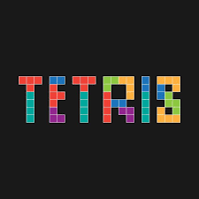
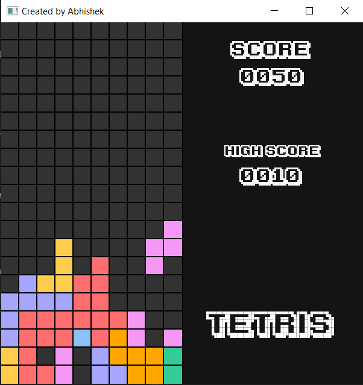

### Tetris in C++ with SFML

This repository contains the source code for a classic Tetris game developed in C++ using the Simple and Fast Multimedia Library (SFML). The game implements core Tetris mechanics like falling Tetriminos, line clearing, scorekeeping, and a user-friendly interface.

<!-- 
-->

|  |  |
|---|---|


#### Features

Traditional Tetris gameplay with random Tetrimino generation
Line clearing with scoring system
Game over state detection
Optional background music and sound effects
Score tracking with a high score file (maxScore.txt)

#### Project Setup

Prerequisites
C++ Compiler: A C++ compiler like GCC or Clang is required to compile the source code. If you don't have one, you can download and install a suitable compiler from the internet.
SFML: Download and install the latest stable version of SFML (https://www.sfml-dev.org/download.php). Make sure to follow the installation instructions for your operating system.

##### Visual Studio Setup (Optional)

Create a new project in Visual Studio. Choose "Empty Project" under C++/Win32.
Add existing items to the project:
All source code files (.cpp and .hpp)
Resource files (.ogg, .ttf, .txt)
Makefile (if you prefer using it)
Configure project properties:
Under "VC++ Directories", add the path to SFML's include directory (#include <SFML/...>) in the "Include Directories" property.
Under "Linker", add the path to SFML's library directory (-L<path/to/sfml-libs>) in the "Additional Library Directories" property.
Add the SFML libraries to the "Additional Dependencies" property.

```bash
sfml-graphics-d.lib
sfml-window-d.lib
sfml-audio-d.lib
sfml-network-d.lib
sfml-system-d.lib
```

##### Using a Makefile (Recommended)

Ensure you have a make utility installed (usually available on Linux and macOS).

The provided Makefile automates compilation and linking:

Code snippet

```bash
all:
	g++ -Wall main.cpp Board.cpp Pieces.cpp UI.cpp Sounds.cpp -lsfml-system -lsfml-window -lsfml-graphics -lsfml-audio -o game
```

Run make in your terminal from the project directory to compile the game.

#### Running the Game

After successful compilation, execute the generated executable (e.g., tetris.exe on Windows) to start the game.

#### Gameplay Controls

Use the arrow keys to move the falling Tetrimino left, right, and down.
Press the up arrow key to rotate the Tetrimino. (Note: Rotation may be restricted in certain positions to maintain game rules.)
Press the spacebar (optional) to drop the Tetrimino immediately.
The game ends when a Tetrimino cannot be placed without overlapping existing blocks.

#### Customization

You can adjust the gameplay difficulty, sound effects, and background music by modifying relevant code in the source files.
The maxScore.txt file stores the highest score achieved. You can reset it manually if desired.

#### Project Structure

The project is organized into several files with well-defined responsibilities:

- **Board.cpp and Board.hpp:** Implement the game board logic, including grid management, line clearing, and scoring.
- **gameOver.ogg, line.ogg, music.ogg, newScore.ogg, and sounds.ogg:** Optional sound effects and background music for a more immersive gameplay experience.
- **ka1.ttf (Karmatic Arcade font):** Font file used for displaying the score and other UI elements.
- **main.cpp:** The entry point of the program, where all game components are initialized, the game loop is managed, and user input is handled.
- **Makefile** (optional): Automated build script for compilation and linking.
- **maxScore.txt:** Stores the highest achieved score.
- **Pieces.cpp and Pieces.hpp:** Responsible for creating and rotating falling pieces also called tetriminous.
- **Sounds.cpp and Sounds.hpp:** For integrating sound into the game.
- **UI.cpp and UI.hpp:** For visual or ui.
